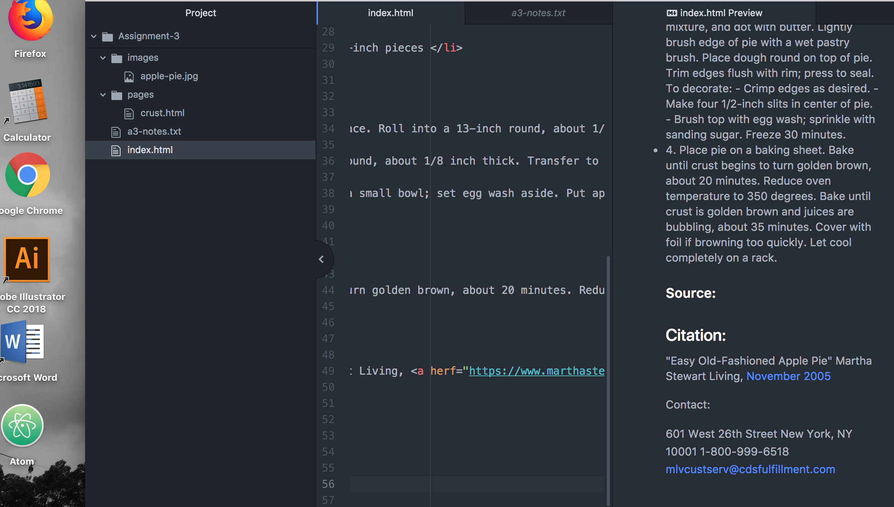

## Assignment 3:
### Technical Report

------------------------------------
The elements of < HEAD > are:
* META
* LINK
* STYLE
* VIEWPORT
* TITLE

The elements of < BODY > are:
* DIV
* Headings h1,h2 etc.
* BLOCK
* HORIZONTAL RULE
* ADDRESS
* TEXT

Structural markup: defines the Structural parameters of a document.

Semantic markup: Interprets the information from the document.

My work flow on this assignment was first to slow down and make sure the basics were done, such as the correct files in the correct places. Finally figuring out how to embed the screenshots!

