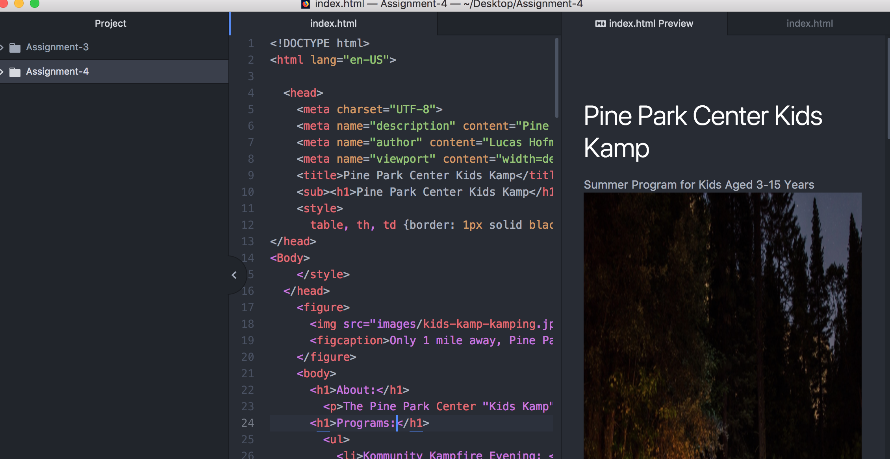

 # Assigment 4: Technical Report
 ------------------------------------------

 ALTERNATIVE TEXT: A way to describe to the viewer what is in and image by word or phrase. This in the event that the viewer can not view the image, they can at least know what is suppose to be there.

 Forms Online: Several small sites such as local little league sign up sites, have these basic functions.

 For this assignment I had trouble linking the phrase to the image. I ended up going with a different image because it worked.
 
