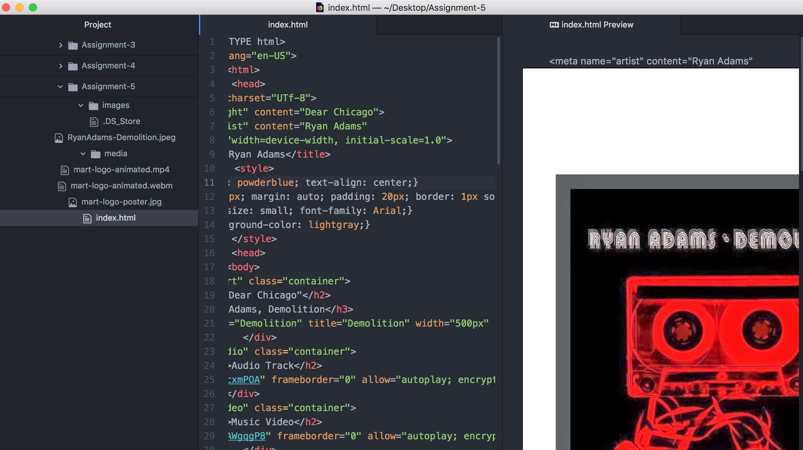

 # Assignment: 5 Tech Repo
 _____________________________________________
 The use of divs in web-dev to create a logical page that makes sense to the end user. This makes divisions between content.

 Youtube is a third party site hosting various creations from music to videos. This shared platform allows for users to share by URL or even by embedded code provided as easy as copy and paste.

 For the project things were pretty smooth, however still having and issue with my audio file from youtube.
 
