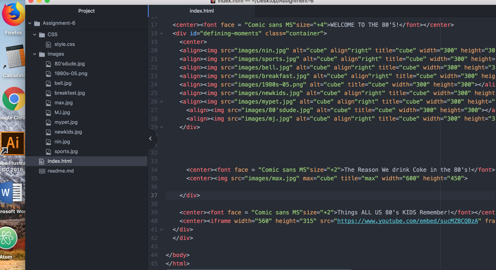

 # Assignment 6 Tech Report
----------------------------------------
On this assignment I chose the 1980's as I grew up in that area it was a chance to go down memory lane a bit. I chose to go the visuals commonly seen back then. It was all about bright colors, I chose Lime green, Royal blue and yellow. These were staple colors of the area. I found this assignment assigning the pan-tone codes. My work-flow was work the steps and go back and review when I got hung up.

