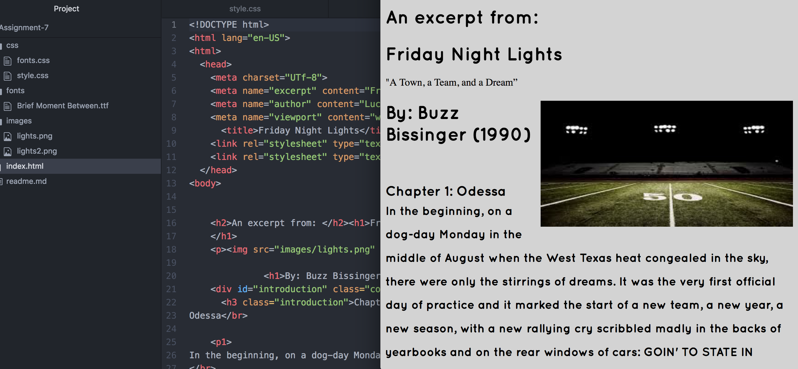

 # Assignment 7 Tech Report

  For this Assignment I chose a san serif: Quicksand font as it seemed like what you would see from a fan page or blog post for a show like this.

FONTS:
 * Web Safe : are fonts safe across all platforms.

 * System Fonts: are just that they are the basic preloaded fonts found on your system.

 * Web Fonts: are those you can either pay for or download from free sites online.

The hardest part of this assignment was picking the font to use and I'm still on the fence about it!

