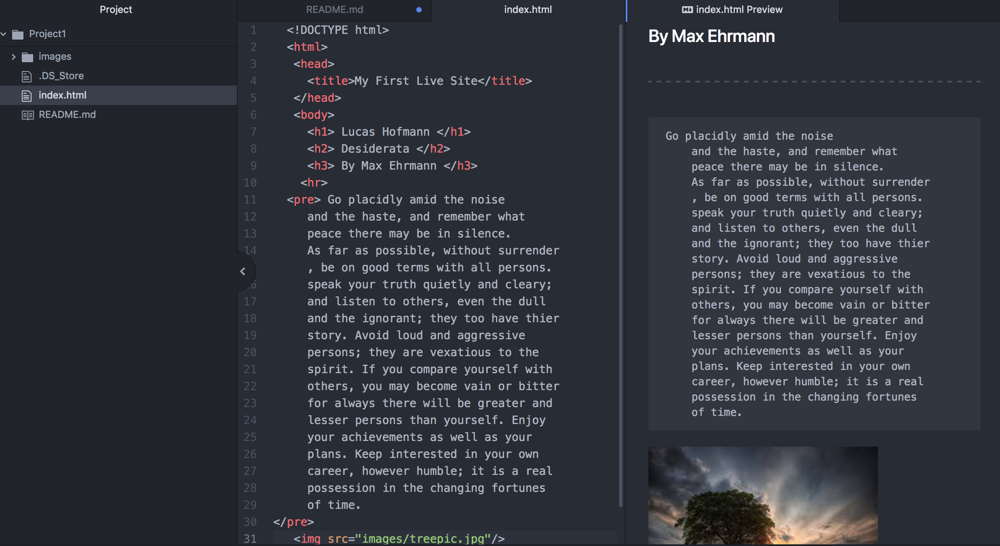

 # Project 1
 _____________________________________
 ## Lucas Hofmann
 _____________________________________
 * I use Firefox 90% of the time.
 Most of my devices are apple and I have had the best results using Firefox.
 * I use Google Chrome 10% of the time.
 When using my android device or a PC I find Chrome to be the best.

 The browser allows the user to access information found at a particular
 URL and then essentially translate it for the user. Its like a
translator for code, it allows the user to view images and written data in an understandable language. This is done by use of the sites domain name.

 The way way back machine was interesting and its amazing how far we have come even in the last 10 years with web dev and to think how AOL was the power house of its time and now its ancient news! I went to some ubul.com stands for ultimate bands list. I remember think these websites were so fancy, now they look like garbage next to a wix site I can make in 45 mins.

 HTML is the standard as I understand it however not easy for a newbie like me!

 
